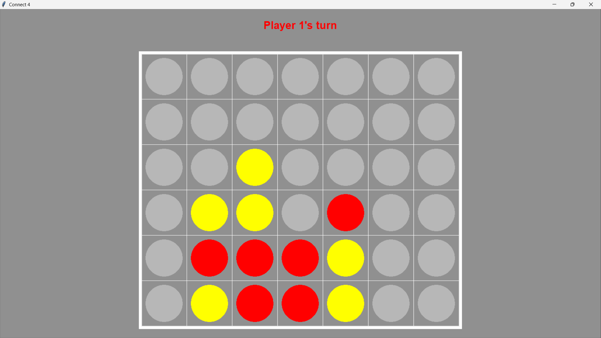

# Connect Four Bot

This project is a Python implementation of the classic game Connect Four.
The game is highly customizable - you can adjust the board size, the number of aligned pieces
required to win, and even the number of players. The included bot uses a minimax algorithm
with alpha-beta pruning and caching to make smart moves, although it usually
(except for small boards) isn't unbeatable, as it should be limited to a certain depth,
if you want it to make moves in a reasonable time.

## Features

- Graphical user interface (GUI) for playing the game
- Light and dark mode
- A main menu to configure the game settings
- Customizable board size, number of aligned pieces required to win, and number of players
- Play against another local player, against a bot, or even against multiple players and bots

## Installation

### Dependencies

The project requires Python 3.6.0 or above to run. It uses tkinter for the GUI, which should be
included in most Python installations. If you don't have it, you can install it using the
following command or a similar one depending on your system:

```bash
sudo apt-get install python-tk
```

Running the game was successfully tested on Python 3.6.0, 3.9.13, 3.10.9, and 3.12.5 on Windows 11
and Python 3.10.12 on Ubuntu 22.04 in WSL.

### Setup

Just download the connect4.py file. It is then ready to be run with Python.

## Usage

To start the game, run the following command within the directory of the project
(where the `connect4.py` file is located):

```
python connect4.py
```

A main menu will appear with the options to configure the game and assign bots to players.


After configuring the game, click the "Start Game" button to start playing.




### Starting with a python script

You can also launch the main menu within another Python script by importing the `MainMenu` class
from the `connect4.py` file and creating an instance of it.

Alternatively, you can import and instantiate the `Game` class (also from the `connect4.py` file)
to start a game directly without the main menu. In this case, you can pass the game settings as
arguments to the constructor according to its docstring. Bots need to be instantiated from the
corresponding classes `RandomBot` or `CachedMinimaxBot` (also in the `connect4.py` file)
and passed as values in the `bots` for the keys corresponding to the player numbers. With this
method, you can also launch the game with other configurations than the ones allowed
in the main menu, but bots may be too slow for those configurations.
